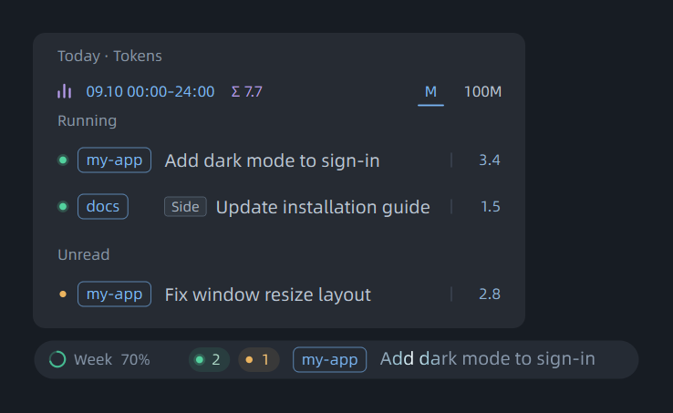
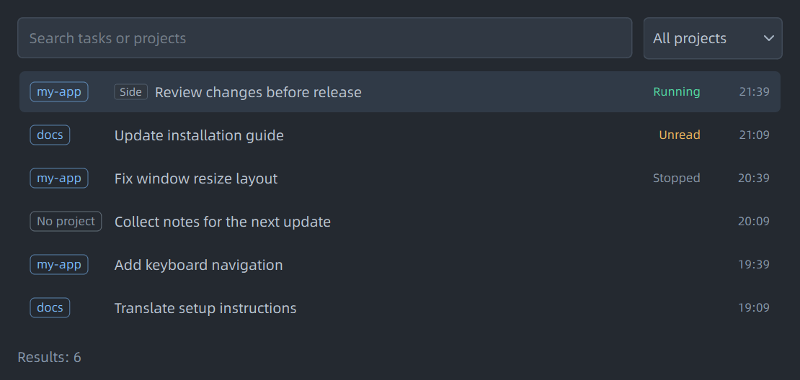
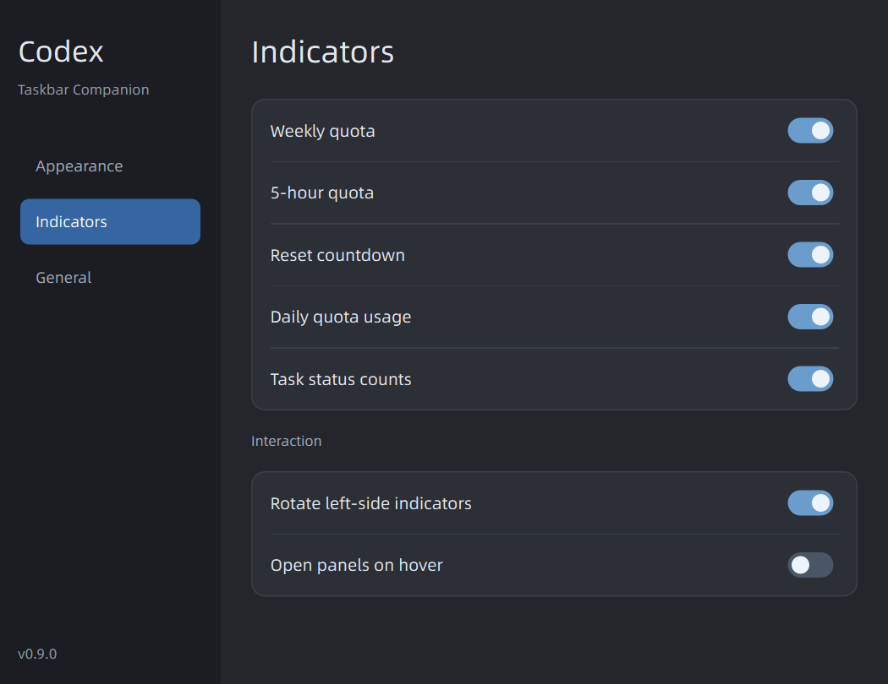
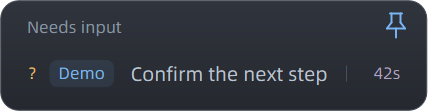

# Codex Taskbar Companion

[English](../../README.md) · [简体中文](README.zh-CN.md) · **日本語** · [Español](README.es.md)

Windows 11 のタスクバー、またはフローティング表示で Codex の利用枠、トークン使用量、タスクの状態を確認できます。

[ダウンロード](https://github.com/dicksick22046/codex-taskbar-companion/releases/latest) · [不具合を報告](https://github.com/dicksick22046/codex-taskbar-companion/issues) · [変更履歴](../../CHANGELOG.md)


*画像のタスクと数値はサンプルです。*

## インストール

**Windows 11 x64** と、インストールしてログイン済みの **Codex デスクトップアプリ**が必要です。

1. [Releases](https://github.com/dicksick22046/codex-taskbar-companion/releases/latest) から `CodexTaskbarCompanion-<version>-Setup-x64.exe` をダウンロードします。
2. インストーラーを実行して起動します。Python、Qt、フォントは同梱されており、管理者権限は不要です。
3. 表示部分を右クリックして設定を開き、表示項目とログイン時の自動起動を選びます。

新規インストールは自動配置です。メインのタスクバーを優先し、空きがなければフローティング表示に切り替えます。更新時は既存の配置設定を保持します。右クリックまたはトレイから、タスク検索、状態別一覧、設定、終了を選べます。

ステータスバーの配置設定は利用枠と状態件数のバーを操作します。実行中タスクの独立バーは別に有効化でき、ドラッグした位置を記憶します。フローティングウィンドウの最前面設定と配色・透明度は両バーで共有します。



**自動**はメインのタスクバーを優先し、空きがないとフローティング表示に切り替えます。空きが安定して戻ると復帰し、前面の全画面アプリには重ねません。**表示先**でメイン画面の追従または特定画面を選べます。切断時は一時的にメイン画面を使い、再接続後に相対位置を復元します。副画面のタスクバーへの埋め込みや、他の Windows 版の実機検証は含みません。

*サンプルデータを使用しています。タスクバー表示と同じ部品・パネルを使います。*

## 操作

| クリックする項目 | 表示内容 |
| --- | --- |
| 週の利用枠 | 現在の利用期間における日別トークン使用量 |
| 当日の利用枠消費 | タスクと状態ごとの当日のトークン使用量 |
| 5h の利用枠（アカウントにある場合） | 残量、リセット時刻、記録済みの残量推移 |
| リセットまでの時間 | リセット履歴と利用可能なリセット権 |
| 状態の点と件数 | その状態のタスクと、現在または直近のターンの所要時間 |
| タスク名 | Codex で該当タスクを開く |

新規利用者は状態件数のみ表示し、実行中タスクの独立バーは初期状態ではオフです。既存利用者の表示設定は保持し、両者を個別に切り替えられます。独立バーは固定幅で実行中タスクを切り替え、ホバー時は切り替えを止めて長い名前を表示します。実行中タスクがなければ隠れます。Main/Side は即時状態表示だけで使い、Side は親タスクを開きます。継続的な光の演出は使いません。

設定で英語・簡体字中国語・日本語・スペイン語を選べます。ホバーでのパネル表示や、利用枠の切り替え表示も設定できます。切り替え表示では、リセットまでの時間を含む有効な左側の項目が、幅の固定された1つの場所に順番に表示されます。

設定でカプセルの配色と背景の透明度を手動で変更できます。ダーク／ライトを選択し、透明度0%で不透明になります。文字とリングの不透明度は変わりません。

右クリックして **タスクを検索…** を選ぶと、名前やプロジェクトで保存済みタスクを検索できます。プロジェクトで絞り込み、クリックまたは矢印キーとEnterでCodexのタスクを開けます。検索はローカルで実行され、検索語は保存しません。絞り込みは検索ウィンドウだけに適用されます。

ステータスバーは有効な項目の実際の幅に合わせ、画面とタスクバーの空き範囲に収めます。項目や切り替え設定を自動変更しません。収まらない場合もトレイの状態別メニューを利用できます。独立タスクバーの幅は切り替え中も一定です。



*サンプルデータです。他のCodexクライアントの入力・承認待ち状態は、現在このツールでは表示できません。*

## 数値の意味

週と5hはアカウントの残量、Todayは観測開始後の使用量です。詳細には当日の観測開始時刻と更新時刻を表示します。取得失敗時は保存値であることを示し、期限切れの残量やリセット時刻は不明として扱います。ローカルのトークン合計からアカウント利用枠を正確に逆算することはできません。

検索はプロジェクト、タスク名、状態、最終更新を優先します。履歴統計を有効にすると累計実行時間、トークン、ターン数と単位を表示します。統計を表示している間だけ履歴を処理し、非表示やウィンドウを閉じると一時停止します。キャッシュ、選択、絞り込みは保持します。`≥` は記録不足時の既知の下限です。

設定のサイドバーから「外観・表示項目・一般」を切り替えます。設定はカプセルの幅を含めてすぐに反映されます。「一般」では回答待ち通知（初期状態はオフ）を有効にでき、タスク名・アカウント・パス・ログを含まない診断情報をコピーできます。

同期的な質問が未回答の場合は「回答待ち」と琥珀色の疑問符を表示し、回答はCodexで行います。通知は新しい待機をまとめ、同じ状態を繰り返し通知しません。非同期の質問、保存されないサイドチャット、人による承認をすべて識別できるわけではありません。





- 利用枠の割合はアカウントから、トークン数はこの PC のタスクログから取得します。トークン数を正確な利用枠の割合や料金に換算することはできません。
- 当日の消費は、その日に取得できた最初の値を基準にします。再起動後も記録は残ります。それ以前の使用量は推測せず、当日にリセットがあれば区間ごとに集計します。
- 日別一覧は当日の各ターンを集計します。状態別一覧の時間は現在または直近のターンのもので、ツールの待ち時間を含みます。
- 過去のトークン合計は、この PC に記録されたタスクが対象です。他の端末や、使用量が保存されていない一時的なサイドチャットは含みません。

リセット履歴は定期、手動、公式の3種類です。定期リセットと本ツールで確認した手動リセット以外の回復を、公式リセットと推定します。これはプラットフォームから提供された発生元ではありません。Tokenは列見出しに一度だけ表示し、各行に数値と単位を残します。リセット権の使用には確認が必要で、実際の権利を1回消費します。

## データと制限

設定、タスク名、使用記録は `%USERPROFILE%/.codex-taskbar-companion` に保存します。更新やアンインストールでは削除しません。会話本文やアカウントの認証情報は保存せず、テレメトリーもありません。スクリーンショットやログを公開する前に個人情報を取り除いてください。

現在は Windows 11 向けの初期リリースです。Windows 10、macOS、複数モニターへの個別表示、サードパーティー製タスクバーは未検証です。インストーラーにコード署名はありません。サイドチャットの検出は Codex のデスクトップログに依存します。一時的な読み取り失敗では有効な記録を維持しますが、すべての一時エラーを検出できるわけではありません。

## 開発

Python 3.12 を使用します。パッケージ作成には Inno Setup も必要です。

```powershell
uv venv --python 3.12 .venv
uv pip install --python .venv/Scripts/python.exe -r requirements-build.txt
./start.ps1
.venv/Scripts/python.exe -m unittest discover
./scripts/package.ps1 -Compiler 'C:/Path/To/Inno Setup/ISCC.exe'
```

ソースから起動する前にインストール版を終了してください。二重起動すると既存の設定画面が開きます。出力先は `dist/` と `release/`、バージョンは `codex_taskbar/build_info.py` で管理します。

`./scripts/preview-session.ps1` では、対象のアカウントがなくてもサンプルデータで 5h パネルを確認できます。別ウィンドウで動作し、アカウントや設定を変更しません。

実装資料（中国語）：[構成](../architecture.md)、[操作仕様](../specs/interaction.md)。

## ライセンス

[MIT](../../LICENSE)。フォントと依存ライブラリにはそれぞれのライセンスが適用されます。[サードパーティーの構成要素](../../THIRD_PARTY.md)を参照してください。OpenAI とは関係のない独立したコミュニティプロジェクトです。
