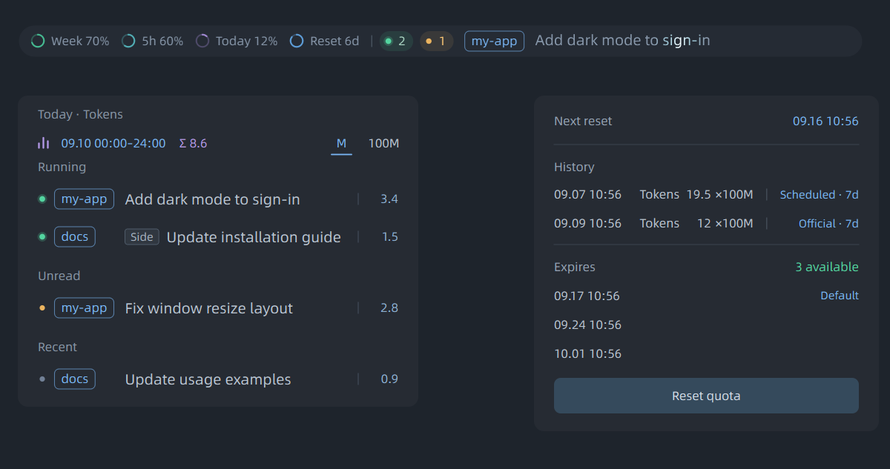

# Codex Taskbar Companion

[English](../../README.md) · **简体中文** · [日本語](README.ja.md) · [Español](README.es.md)

在 Windows 11 任务栏显示 Codex 额度、Token 用量和任务状态。

[下载](https://github.com/dicksick22046/codex-taskbar-companion/releases/latest) · [反馈问题](https://github.com/dicksick22046/codex-taskbar-companion/issues) · [更新记录](../../CHANGELOG.md)



*图中的任务和数值为演示数据。*

## 安装

需要 **Windows 11 x64**，并已安装、登录 **Codex 桌面版**。

1. 从 [Releases](https://github.com/dicksick22046/codex-taskbar-companion/releases/latest) 下载 `CodexTaskbarCompanion-版本号-Setup-x64.exe`。
2. 安装并启动。安装包包含 Python、Qt 和字体，不需要另外配置环境或管理员权限。
3. 右键状态条打开设置，选择显示项目和是否开机启动。

状态条位于主任务栏左侧。空间不足时，可从系统托盘打开设置。更新从 GitHub 检查，由你选择是否安装。

## 使用

| 点击位置 | 查看内容 |
| --- | --- |
| 周额度 | 当前额度周期每天的 Token 用量 |
| 今日额度消耗 | 按任务和状态分类的今日 Token 用量 |
| 5h 额度（账户提供时） | 剩余额度、重置时间和已记录的余额变化 |
| 重置倒计时 | 重置历史和可用的重置机会 |
| 状态圆点与数量 | 该状态的任务，以及当前或最近一轮的耗时 |
| 任务标题 | 在 Codex 中打开该任务 |

进行中的任务会轮换显示。鼠标移入后暂停轮换，长标题会滚动展开。未读、停止和失败分别显示状态。侧边聊天运行时，所属任务也算进行中，同一个任务只计一次。

设置中可切换英文、简体中文、日语和西班牙语，也可开启悬停打开面板或额度轮换。轮换时，已开启的本周、今日、5h和重置倒计时共用一个固定宽度位置。

## 数据怎么算

胶囊配色和背景透明度可在设置中手动调整。深浅两套配色，0%透明度表示不透明背景；文字和圆环不会一起变淡。

- 额度百分比来自账户，Token 来自本机任务日志。Token 总量不能准确换算为额度百分比或订阅费用。
- 今日额度消耗从当天第一条可用记录开始计算，重启保留。之前的用量不补算；当天发生重置时分段累计。
- 日列表统计今天的多轮任务用量；状态列表显示当前或最近一轮的耗时，包含工具等待时间。
- 历史 Token 只统计本机已记录的任务，不包含其他设备，以及没有保存用量的临时侧边聊天。

重置历史中，Scheduled 表示观察到自然到期，Manual 表示通过本工具确认成功的手动重置，其他已观察到的恢复归为 Official。Official 是推定分类，不代表已核实官方来源。使用重置机会需要二次确认，会消耗真实机会。

## 数据保存与限制

设置、任务名称和用量记录保存在 `%USERPROFILE%/.codex-taskbar-companion`，更新和卸载都会保留。工具不保存对话正文或账号凭据，没有遥测。提交截图和日志前，请去掉私人信息。

目前是 Windows 11 的早期版本。Windows 10、macOS、多屏独立状态条和第三方任务栏未验证，安装包尚未代码签名。侧边聊天依赖 Codex 桌面日志，日志格式变化后可能需要更新适配。暂时读取失败会保留有效数据，但无法捕获 Codex 的所有瞬时错误。

## 开发

需要 Python 3.12；打包还需要 Inno Setup。

```powershell
uv venv --python 3.12 .venv
uv pip install --python .venv/Scripts/python.exe -r requirements-build.txt
./start.ps1
.venv/Scripts/python.exe -m unittest discover
./scripts/package.ps1 -Compiler 'C:/Path/To/Inno Setup/ISCC.exe'
```

运行源码前先退出安装版，重复启动会打开已有实例的设置。构建结果在 `dist/` 和 `release/`，版本号位于 `codex_taskbar/build_info.py`。

没有 5h 额度的账号可运行 `./scripts/preview-session.ps1`，用独立窗口里的模拟数据预览，不修改账号或设置。

开发说明：[架构](../architecture.md)、[交互规范](../specs/interaction.md)。

## 许可

代码采用 [MIT](../../LICENSE)，字体和依赖保留各自许可，见[第三方说明](../../THIRD_PARTY.md)。这是独立社区项目，与 OpenAI 没有隶属关系。
